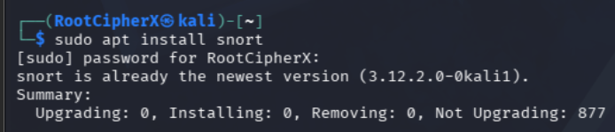
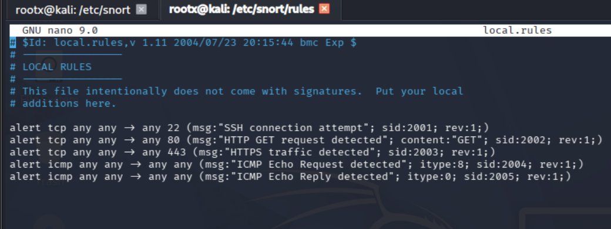
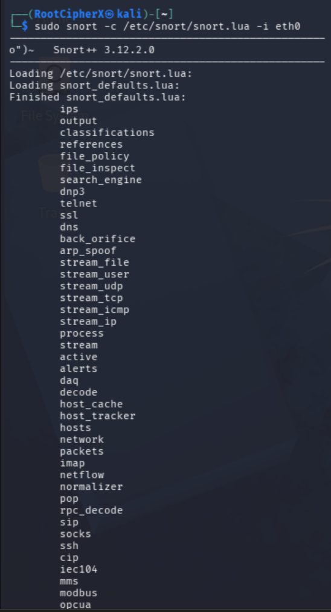
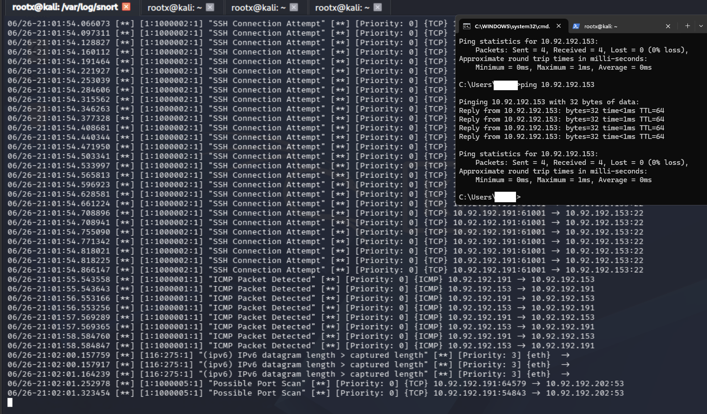

# 🛡️ Cybersecurity: Snort IDS Configuration & Traffic Analysis

## 📖 Table of Contents
- [Introduction](#-introduction)
- [Objective](#-objective)
- [Lab Environment](#️-lab-environment)
- [Methodology & Practical Tasks](#-methodology--practical-tasks)
  - [1. Installation & Configuration](#1-installation--configuration)
  - [2. Writing Custom Rules](#2-writing-custom-rules)
  - [3. Initializing Snort in IDS Mode](#3-initializing-snort-in-ids-mode)
  - [4. Triggering & Analyzing Alerts](#4-triggering--analyzing-alerts)
- [Executive Summary & Conclusion](#-executive-summary--conclusion)
- [Ethical Guidelines & Disclaimer](#️-ethical-guidelines--disclaimer)

---

## 📖 Introduction
Snort is an industry-standard, open-source Network Intrusion Detection System (NIDS) and Intrusion Prevention System (NIPS). It allows security professionals and network administrators to monitor network traffic in real-time, analyze packets, detect suspicious or malicious activities, and generate alerts based on predefined or custom rules. 

A Snort rule is a text-based instruction that tells the engine exactly what type of network traffic to inspect and what action to take when a specific pattern is detected. These rules are processed sequentially to identify everything from basic reconnaissance to advanced exploitation attempts.

## 🎯 Objective
To deploy, configure, and operate Snort as a Network Intrusion Detection System (NIDS). The objective is to write custom detection signatures (rules) and validate their effectiveness by generating alerts for specific network anomalies, including ICMP sweeps, aggressive Port Scans, and SSH Brute Force attacks.

## 🛠️ Lab Environment
*   **Operating System:** Kali Linux (IDS Sensor)
*   **Target/Sensor IP:** `10.92.192.153`
*   **Attacker IP:** `10.92.192.191` (and Windows host for ICMP)
*   **Tool Used:** Snort 3.12.2.0
*   **Configuration File:** `/etc/snort/snort.conf`
*   **Rule File:** `/etc/snort/rules/local.rules`

---

## 🚀 Methodology & Practical Tasks

### 1. Installation & Configuration
**Objective:** To install the Snort engine and verify the configuration files.

**Methodology:**
Snort was installed and verified via the Kali Linux apt package manager. Once verified, the primary configuration file (`snort.conf`) was accessed to ensure the environment variables and network interfaces were properly defined for the local subnet.
*   **Commands executed:** 
    *   `sudo apt install snort`
    *   `sudo nano /etc/snort/snort.conf`

**Result / Evidence:**
 

---

### 2. Writing Custom Rules
**Objective:** To create custom text-based instructions (`local.rules`) to detect specific attack vectors.

**Methodology:**
I edited the local rules file using `sudo nano /etc/snort/rules/local.rules` to create custom detection signatures. 

**Rules Implemented:**
*   **SSH Brute Force Detection:** `alert tcp any any -> any 22 (msg:"SSH connection attempt"; sid:2001; rev:1;)`
*   **HTTP/HTTPS Traffic:** 
    *   `alert tcp any any -> any 80 (msg:"HTTP GET request detected"; content:"GET"; sid:2002; rev:1;)`
    *   `alert tcp any any -> any 443 (msg:"HTTPS traffic detected"; sid:2003; rev:1;)`
*   **ICMP Sweep Detection:**
    *   `alert icmp any any -> any any (msg:"ICMP Echo Request detected"; itype:8; sid:2004; rev:1;)`
    *   `alert icmp any any -> any any (msg:"ICMP Echo Reply detected"; itype:0; sid:2005; rev:1;)`

**Result / Evidence:**
 

---

### 3. Initializing Snort in IDS Mode
**Objective:** To launch Snort and bind it to the network interface for real-time packet processing.

**Command Executed:**
`sudo snort -c /etc/snort/snort.conf -A console`

**Command Breakdown:**
*   `sudo snort`: Runs the engine with elevated privileges required for packet sniffing.
*   `-c /etc/snort/snort.conf`: Points Snort to the main configuration file to load the custom rules.
*   `-A console`: Instructs Snort to print alerts directly to the terminal screen in real-time (Fast Alert mode).

**Result / Evidence:**
 

---

### 4. Triggering & Analyzing Alerts
**Objective:** To validate the custom rules by simulating attacks and monitoring the resulting alerts.

**Methodology:**
With Snort running in IDS mode on the console, external machines (including a Windows host) were used to trigger the rules:
1.  **ICMP:** Sent ping requests to the IDS interface (`ping 10.92.192.153`).
2.  **Port Scan:** Executed an aggressive scan against the sensor.
3.  **SSH Connection:** Attempted rapid SSH logins from `10.92.192.191` to `10.92.192.153` on port 22.

**Observation:**
The Snort engine successfully intercepted the packets in real-time, matched the malicious traffic patterns against `local.rules`, and generated priority alerts directly to the console. The output clearly identifies the source IP triggering the "SSH Connection Attempt", the "ICMP Packet Detected" from the Windows host, and the overarching "Possible Port Scan".

**Result / Evidence:**
 

---

## 📊 Executive Summary & Conclusion
The Snort command is a powerful, flexible, and open-source network security tool that plays a vital role in protecting computer networks. In this lab, Snort was successfully configured from the ground up as a Network Intrusion Detection System (NIDS). 

By writing custom detection rules, the engine was able to successfully identify and alert on reconnaissance attempts (ICMP/Port Scanning) and active exploitation attempts (SSH Connections). Its real-time traffic analysis, customizable rule engine, and threat detection capabilities prove why it is so widely used in cybersecurity labs, enterprise networks, and Security Operations Centers (SOCs) globally.

---

## ⚖️ Ethical Guidelines & Disclaimer
This intrusion detection deployment and subsequent attack simulation were conducted entirely within a private, self-hosted Virtual Machine laboratory network. All traffic generation, scanning, and monitoring were performed strictly for educational and defensive cybersecurity training purposes.
